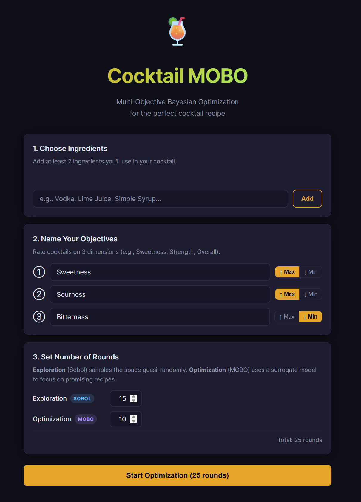
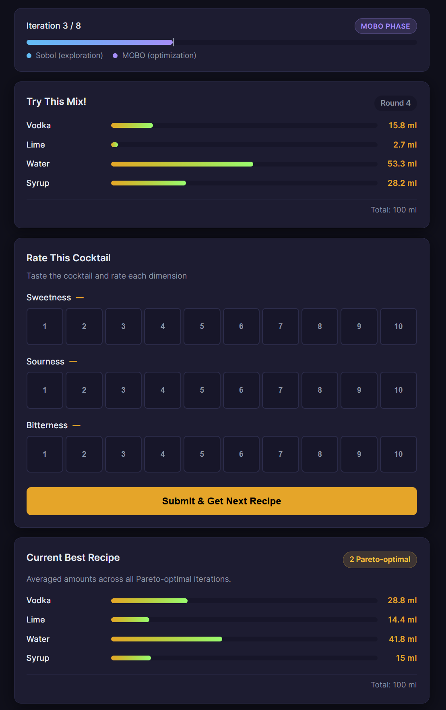
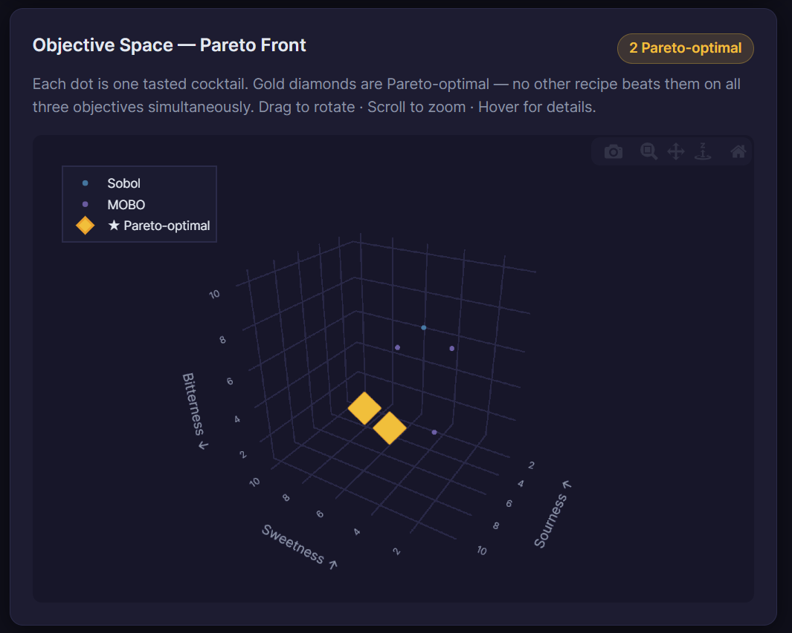
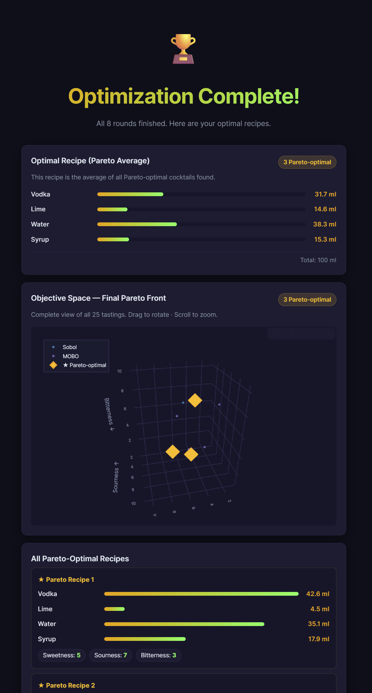

# 🍹 Cocktail MOBO Optimizer

A Progressive Web App that uses **Multi-Objective Bayesian Optimization** (via [BoTorch](https://github.com/meta-pytorch/botorch)) to find the optimal cocktail recipe by iterating on human taste feedback.

## Screenshots

| Setup | Optimization loop |
|:---:|:---:|
|  |  |

| Pareto front (3D) | Results |
|:---:|:---:|
|  |  |

> **To add screenshots:** run the app, take a screenshot of each view, and save the files to `docs/screenshots/` using the filenames above.

---

## How it works

| Phase | Default rounds | Method |
|---|---|---|
| Exploration | 15 (configurable) | Sobol quasi-random sampling |
| Optimization | 10 (configurable) | qNoisyExpectedHypervolumeImprovement (qNEHVI) |

After each tasting the app:
1. Records your 3-objective Likert ratings (1–10 scale)
2. Re-fits a Gaussian Process model on all past evaluations
3. Selects the next cocktail that maximises the Expected Hypervolume Improvement
4. Recomputes the **Pareto front** (non-dominated recipes) and shows you the average of Pareto-optimal ingredient amounts

---

## Requirements

- **Python 3.10+**
- A machine that can run PyTorch (CPU is fine)

---

## Quick start

### Windows (double-click or Command Prompt)
```bat
start.bat
```

### macOS / Linux / MSYS2 / Git Bash
```bash
chmod +x start.sh
./start.sh
```

Then open **http://localhost:8000** in your browser.

---

## Manual setup

```bash
# 1. Install backend dependencies
pip install -r backend/requirements.txt

# 2. Start the server
cd backend
python main.py

# 3. Open http://localhost:8000 in your browser
```

---

## App flow

1. **Setup** – Enter your ingredients, name the 3 objectives (e.g., Sweetness, Strength, Balance), choose a direction (↑ Max / ↓ Min) for each, and set the number of Exploration and Optimization rounds.
2. **Exploration** – The app suggests Sobol-sampled ingredient amounts. Taste each cocktail and rate each objective 1–10.
3. **Optimisation** – The BoTorch MOBO model (qNEHVI) proposes ingredient amounts that are predicted to improve the multi-objective trade-off.
4. **Results** – A full Pareto-front is shown, with the averaged optimal recipe highlighted.

### Ingredient amounts

Each ingredient is represented as **0–100 ml**. You can scale all amounts proportionally to fit your glass size.

---

## Project structure

```
CocktailApp/
├── backend/
│   ├── main.py          # FastAPI server
│   ├── optimizer.py     # BoTorch MOBO logic
│   └── requirements.txt
├── frontend/
│   ├── index.html       # PWA shell
│   ├── style.css        # Dark cocktail theme
│   ├── app.js           # Frontend JS
│   ├── manifest.json    # PWA manifest
│   └── service-worker.js
├── start.bat            # Windows launcher
├── start.sh             # Unix launcher
└── README.md
```

---

## API endpoints

| Method | Path | Description |
|---|---|---|
| `POST` | `/api/session/create` | Start a new optimisation session |
| `GET` | `/api/suggest` | Get next suggested ingredient amounts |
| `POST` | `/api/evaluate` | Submit Likert ratings for current suggestion |
| `GET` | `/api/state` | Get full state (history + Pareto front) |
| `POST` | `/api/reset` | Reset the session |
